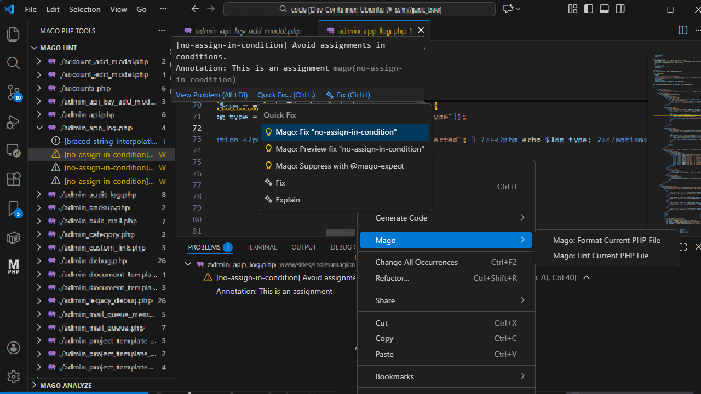

# Mago PHP Tools

Format, lint, and analyze PHP in VS Code using the **Mago** CLI, with automatic `mago.toml` detection.



## Features

- **Format current PHP file** (`mago fmt`)
- **Lint current PHP file** (`mago lint`)
- Optional **format on save** and **lint on save**
- **Lint project** with results in an Explorer view
- **Analyze project** with focused diagnostics per issue


## Requirements

- **Mago CLI** installed and accessible (or configure `magoPhpTools.magoPath`)
- A `mago.toml` file is **required for project commands**


## Project Root & Config Resolution

When running commands, the extension walks up from the active file until it finds `mago.toml`.  
That folder is used as the **project root**.

**Bundled config behavior:**
- ✅ Format / Lint current file → fallback to bundled config
- ❌ Lint Project / Analyze Project → requires project `mago.toml`

> Monorepo tip: open a PHP file inside the target project before running project commands.


## Usage

**Format / Lint current file**
- Command Palette → `Mago: Format Current PHP File`
- Command Palette → `Mago: Lint Current PHP File`
- Or use the editor context menu
- Or enable on-save options

**Lint / Analyze project**
- Command Palette → `Mago: Lint Project`
- Command Palette → `Mago: Analyze Project`
- View results under **Mago PHP Tools** in the Explorer


## Commands

| Command | Description |
|------|-----------|
| Mago: Format Current PHP File | Format the active file |
| Mago: Lint Current PHP File | Lint the active file |
| Mago: Lint Project | Lint the project |
| Mago: Analyze Project | Analyze the project |


## Settings

```json
{
  "magoPhpTools.magoPath": "mago",
  "magoPhpTools.formatOnSave": true,
  "magoPhpTools.lintOnSave": true
}
```

## License

MIT
